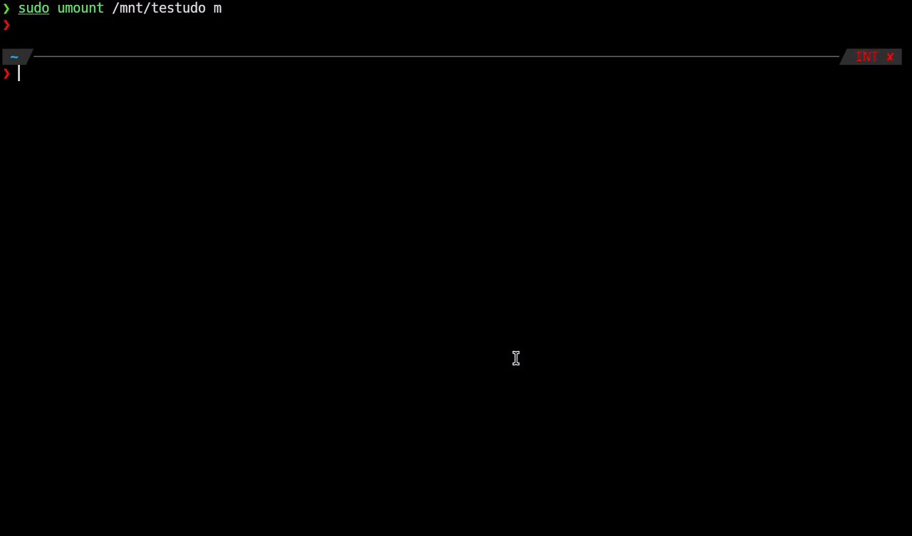
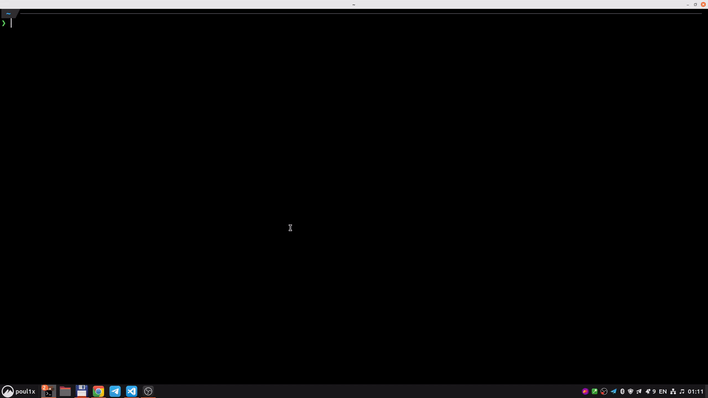

# UNC Tool

Seamlessly convert between Linux and Windows UNC paths. Convert local Linux path to Windows/Linux UNC and vice versa.



## Usage

Convert between Linux and Windows UNC:

```bash
unctool convert 'smb://mynas.local/some/path' -t windows
# \\mynas.local\some\path

unctool convert '\\mynas.local\some\path' -t linux
# smb://mynas.local/some/path
```

Convert to remote UNC:

```bash
unctool remote-path /mnt/mynas.local/some/path -t windows
# \\mynas.local\some\path

unctool remote-path /mnt/mynas.local/some/path -t linux
# smb://mynas.local/some/path
```

Convert from remote UNC:

```bash
unctool local-path '\\mynas.local\some\path'
# /mnt/mynas.local/some/path

unctool local-path 'smb://mynas.local/some/path'
# /mnt/mynas.local/some/path
```

## UNC Tool GUI

Run without arguments to open input window:

```bash
unctool-gui
```

Or use unctool-like CLI interface to go straight to results in GUI:

```bash
unctool-gui <command> [-t windows|linux]
```



## Installation

### Using Cargo

Install unctool CLI:

```bash
cargo install unctool-cli
```

Install unctool GUI:

```bash
cargo install unctool-gui
```

Install unctool library:

```bash
cargo install unctool
```

### From GitHub releases

Install unctool CLI:

```bash
curl -sL -o unctool https://github.com/poul1x/unctool/releases/latest/download/unctool-cli-x64
chmod +x unctool
sudo mv unctool /usr/local/bin

# Test run
unctool --help
```

Install unctool GUI:

```bash
curl -sL -o unctool-gui https://github.com/poul1x/unctool/releases/latest/download/unctool-gui-x64
chmod +x unctool-gui
sudo mv unctool-gui /usr/local/bin

# Test run
unctool-gui --help
```

## Build from sources

### Linux 64-bit:

```bash
git clone https://github.com/poul1x/unctool.git
cd unctool

rustup target add x86_64-unknown-linux-musl
cargo build --release --target x86_64-unknown-linux-musl
cp ./target/x86_64-unknown-linux-musl/release/unctool-cli unctool-cli
cp ./target/x86_64-unknown-linux-musl/release/unctool-gui unctool-gui

# Test runs
./unctool-cli --help
./unctool-gui --help
```

## Integrate with your File Manager

Unctool can be integrated into a file manager. I tested it only with **double commander** and **vifm**, but other file managers should work too.

### Double Commander

1. Open **Configuration → Options**
1. Go to **Toolbar** and insert new button
2. Configure:
   - **Button type**: `External command`
   - **Command**: `unctool-gui`
   - **Parameters**: `remote-path %fs -t windows`
3. Apply (Press `OK`)

Now you can select any file in a mounted network share and get its Windows UNC path with one click!


